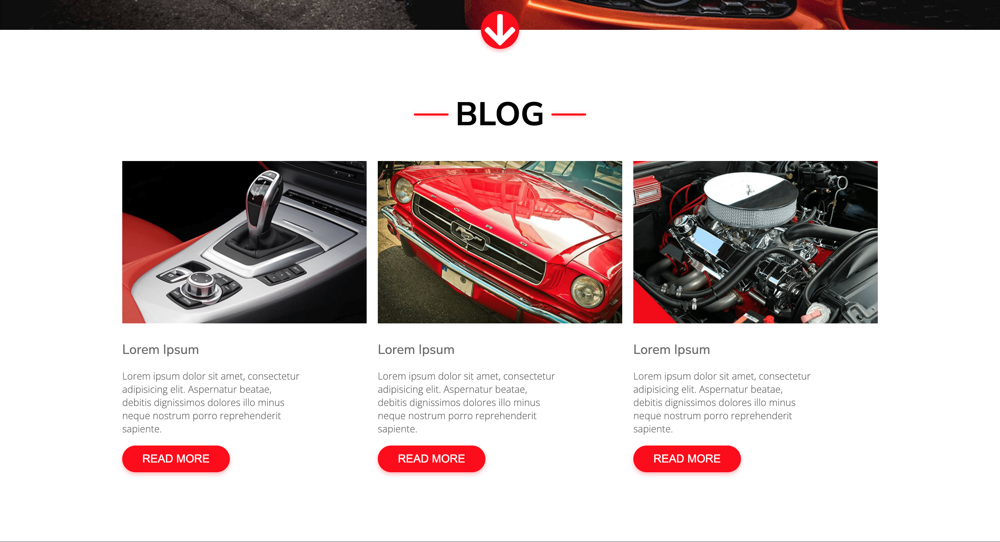
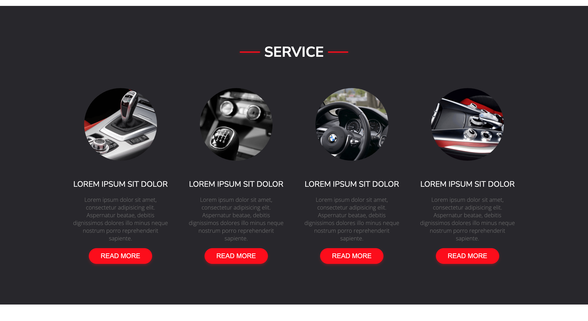
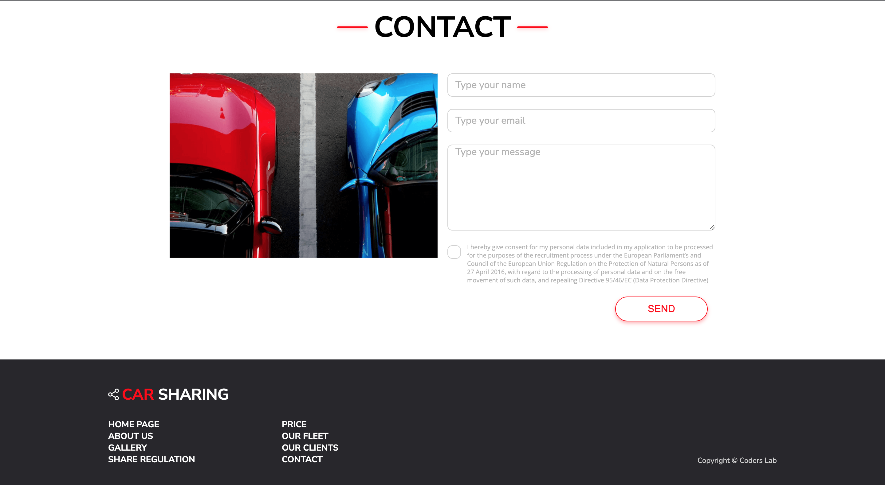

# Car_sharing
Not responsive web design done on CL workshops

# Table of Contents

* [General Info](#general-info)
* [Technologies Used](#technologies-used)
* [Screenshots](#screenshots)
* [Setup](#setup)
* [Project Status](#project-status)
* [Room for Improvement](#room-for-improvement)
* [Contact](#contact)

## General info

* car sharing website created on Coderslab bootcamp
* 

## Technologies Used
* HTML
* CSS

## Screenshots
Header

Blog

Service

Contact Footer

## Setup

* download or clone repository 
* open index.html file in browser

## Room for Improvement

* validation and contact form.
* responsive view
* liks to sections

## Contact

Project Created by [Michał Mardosz](https://www.linkedin.com/in/micha%C5%82-mardosz-298892228/) 
